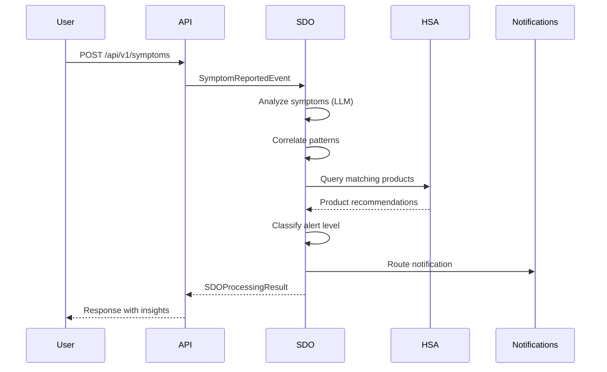
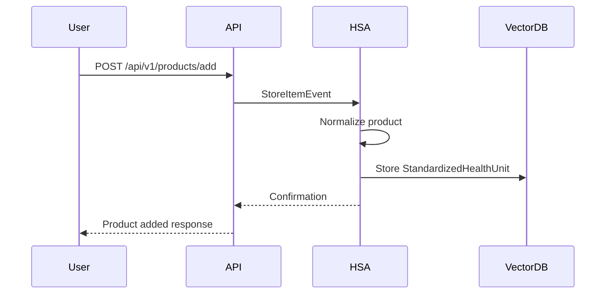

# Diet Insight Engine API

## Overview

The Diet Insight Engine provides an event-driven API for:
- **SDO (Symptom-Diet Optimizer)**: Process user symptoms and generate dietary recommendations
- **HSA (Health Store Agent)**: Search and manage health products from integrated stores

## Architecture

```
┌─────────────────────────────────────────────────────────────────┐
│                        API Gateway                               │
├─────────────────────────────────────────────────────────────────┤
│  POST /symptoms      │  POST /products/search  │  GET /stores   │
│  POST /symptoms/batch│  POST /products/add     │  GET /health   │
└─────────┬────────────┴──────────┬──────────────┴────────────────┘
          │                       │
          ▼                       ▼
┌─────────────────────┐   ┌─────────────────────┐
│        SDO          │   │        HSA          │
│  Symptom-Diet       │   │  Health Store       │
│  Optimizer          │   │  Agent              │
├─────────────────────┤   ├─────────────────────┤
│ • SymptomAnalyzer   │   │ • StoreFactory      │
│ • PatternCorrelator │   │ • ProductNormalizer │
│ • DietRecommender   │   │ • ShopAdapter       │
│ • AlertClassifier   │   │ • (Future Adapters) │
└─────────┬───────────┘   └─────────┬───────────┘
          │                         │
          ▼                         ▼
┌─────────────────────────────────────────────────────────────────┐
│                    Notification Router                           │
│  Routes alerts to: In-App │ Push │ Email based on level         │
└─────────────────────────────────────────────────────────────────┘
```

---

## Event Flow

### 1. User Reports Symptoms



### 2. User Adds Store Item



---

## API Endpoints

### Health Check

```http
GET /health
```

**Response:**
```json
{
  "status": "healthy",
  "service": "diet-insight-engine",
  "version": "1.0.0"
}
```

---

### Symptoms API

#### Report Symptoms

```http
POST /api/v1/symptoms
Content-Type: application/json
```

**Request Body:**
```json
{
  "user_id": "user_123",
  "symptoms": [
    {
      "name": "fatigue",
      "severity": 0.7,
      "duration_hours": 48,
      "frequency": "daily",
      "notes": "Worse in the afternoon"
    },
    {
      "name": "headache",
      "severity": 0.5,
      "duration_hours": 4
    }
  ],
  "context": {
    "recent_foods": ["coffee", "salad", "pasta"],
    "sleep_hours": 5.5,
    "stress_level": 7,
    "exercise_minutes": 0
  }
}
```

**Response:**
```json
{
  "process_id": "uuid",
  "user_id": "user_123",
  "success": true,
  "processing_time_ms": 245.5,
  "analysis": {
    "insights": [
      {
        "category": "deficiency_indicator",
        "title": "Potential Iron Deficiency",
        "description": "Fatigue patterns suggest possible iron deficiency",
        "confidence": 0.75,
        "severity": 0.7
      }
    ],
    "deficiencies": [
      {
        "nutrient": "iron",
        "deficiency_likelihood": 0.7,
        "supporting_symptoms": ["fatigue"],
        "recommended_intake": "18mg daily",
        "food_sources": ["red meat", "spinach", "lentils"]
      }
    ],
    "patterns_detected": ["fatigue_pattern"],
    "severity_score": 0.6
  },
  "recommendations": {
    "dietary_recommendations": [
      {
        "nutrient": "iron",
        "priority": 3,
        "food_suggestions": ["red meat", "spinach", "lentils"],
        "meal_ideas": ["Spinach salad with lemon dressing"]
      }
    ],
    "supplement_recommendations": [
      {
        "nutrient": "iron",
        "dosage_suggestion": "18-25mg daily with vitamin C",
        "products": []
      }
    ],
    "priority_actions": [
      "Increase iron-rich foods in diet",
      "Consider iron supplement if symptoms persist"
    ]
  },
  "notification": {
    "alert_level": "SUGGESTION",
    "title": "📋 Health Suggestion: Consider Iron",
    "message": "Based on your symptoms, dietary adjustments could help."
  }
}
```

#### Batch Symptom Processing

```http
POST /api/v1/symptoms/batch
Content-Type: application/json
```

**Request Body:**
```json
{
  "events": [
    {
      "user_id": "user_123",
      "symptoms": [{"name": "fatigue", "severity": 0.6}]
    },
    {
      "user_id": "user_456",
      "symptoms": [{"name": "headache", "severity": 0.5}]
    }
  ]
}
```

---

### Products API (HSA)

#### Search Products

```http
POST /api/v1/products/search
Content-Type: application/json
```

**Request Body:**
```json
{
  "query": "vitamin d supplement",
  "store_types": ["shop"],
  "symptoms": ["fatigue", "mood"],
  "deficiencies": ["vitamin_d"],
  "dietary_requirements": ["vegan", "gluten_free"],
  "max_price": 50.00,
  "limit": 10
}
```

**Response:**
```json
{
  "request_id": "uuid",
  "query": "vitamin d supplement",
  "stores_searched": ["shop"],
  "total_results": 3,
  "results": [
    {
      "id": "shu_001",
      "name": "Vitamin D3 5000 IU",
      "brand": "Syntropy Essentials",
      "category": "vitamin",
      "description": "High-potency Vitamin D3 for immune support",
      "price": {"amount": 24.99, "currency": "USD"},
      "quality_score": 0.85,
      "target_symptoms": ["fatigue", "mood", "immune"],
      "target_deficiencies": ["vitamin_d"],
      "dietary_tags": ["vegan", "gluten_free"]
    }
  ],
  "processing_time_ms": 45.2
}
```

#### Add Product to Store

```http
POST /api/v1/products/add
Content-Type: application/json
```

**Request Body:**
```json
{
  "store_type": "shop",
  "user_id": "admin_001",
  "product": {
    "name": "Magnesium Glycinate 400mg",
    "description": "Highly absorbable magnesium for relaxation and sleep",
    "brand": "Syntropy Essentials",
    "category": "mineral",
    "price": 29.99,
    "nutrients": {
      "magnesium": {"amount": 400, "unit": "mg", "daily_value_percent": 95}
    },
    "health_claims": ["Supports relaxation", "Promotes sleep quality"],
    "dietary_tags": ["vegan", "gluten_free", "non_gmo"],
    "target_symptoms": ["stress", "insomnia", "muscle_cramps"],
    "target_deficiencies": ["magnesium"]
  }
}
```

**Response:**
```json
{
  "success": true,
  "event_id": "uuid",
  "product_id": "shop_mag_001",
  "message": "Product added successfully",
  "standardized_unit": {
    "id": "shu_new_001",
    "name": "Magnesium Glycinate 400mg",
    "quality_score": 0.82
  }
}
```

---

### Stores API

#### List Available Stores

```http
GET /api/v1/stores
```

**Response:**
```json
{
  "stores": [
    {
      "store_type": "shop",
      "store_name": "Syntropy Shop",
      "status": "active",
      "product_count": 150,
      "capabilities": ["search", "add", "update"]
    }
  ]
}
```

#### Get Store Info

```http
GET /api/v1/stores/{store_type}
```

**Response:**
```json
{
  "store_type": "shop",
  "store_name": "Syntropy Shop",
  "status": "active",
  "product_count": 150,
  "last_sync": "2025-01-14T10:30:00Z",
  "capabilities": ["search", "add", "update"]
}
```

---

## Alert Levels

| Level | Trigger Conditions | Notification Channels |
|-------|-------------------|----------------------|
| **TIPS** | Low severity (<0.3), informational | In-App only |
| **SUGGESTION** | Moderate severity (0.3-0.7), actionable patterns | In-App, Push |
| **ALERT** | High severity (>0.7), urgent indicators | In-App, Push, Email |

---

## Event Types

| Event | Description | Produced By |
|-------|-------------|-------------|
| `SymptomReportedEvent` | User reports symptoms | API |
| `InsightGeneratedEvent` | Analysis complete | SDO Analyzer |
| `ProductQueryEvent` | Product search triggered | SDO Recommender |
| `ProductMatchedEvent` | Products found | HSA |
| `RecommendationGeneratedEvent` | Recommendations ready | SDO Recommender |
| `AlertTriggeredEvent` | Alert classified | SDO Classifier |
| `StoreItemEvent` | Product added/updated | HSA |

---

## Error Responses

```json
{
  "error": {
    "code": "VALIDATION_ERROR",
    "message": "Invalid symptom severity: must be between 0 and 1",
    "details": {
      "field": "symptoms[0].severity",
      "value": 1.5
    }
  }
}
```

| Error Code | HTTP Status | Description |
|------------|-------------|-------------|
| `VALIDATION_ERROR` | 400 | Invalid request data |
| `USER_NOT_FOUND` | 404 | User ID not found |
| `STORE_NOT_FOUND` | 404 | Store type not registered |
| `PROCESSING_ERROR` | 500 | SDO/HSA processing failed |
| `LLM_UNAVAILABLE` | 503 | LLM service unavailable (fallback used) |

---

## Rate Limits

| Endpoint | Rate Limit |
|----------|------------|
| `POST /symptoms` | 60/minute per user |
| `POST /symptoms/batch` | 10/minute |
| `POST /products/search` | 120/minute per user |
| `POST /products/add` | 30/minute |

---

## SDK Examples

### Python

```python
import httpx

async def report_symptoms(user_id: str, symptoms: list):
    async with httpx.AsyncClient() as client:
        response = await client.post(
            "http://localhost:8000/api/v1/symptoms",
            json={
                "user_id": user_id,
                "symptoms": symptoms
            }
        )
        return response.json()

# Usage
result = await report_symptoms("user_123", [
    {"name": "fatigue", "severity": 0.7}
])
print(result["notification"]["title"])
```

### cURL

```bash
# Report symptoms
curl -X POST http://localhost:8000/api/v1/symptoms \
  -H "Content-Type: application/json" \
  -d '{
    "user_id": "user_123",
    "symptoms": [{"name": "fatigue", "severity": 0.7}]
  }'

# Search products
curl -X POST http://localhost:8000/api/v1/products/search \
  -H "Content-Type: application/json" \
  -d '{
    "query": "vitamin d",
    "store_types": ["shop"],
    "limit": 5
  }'
```
