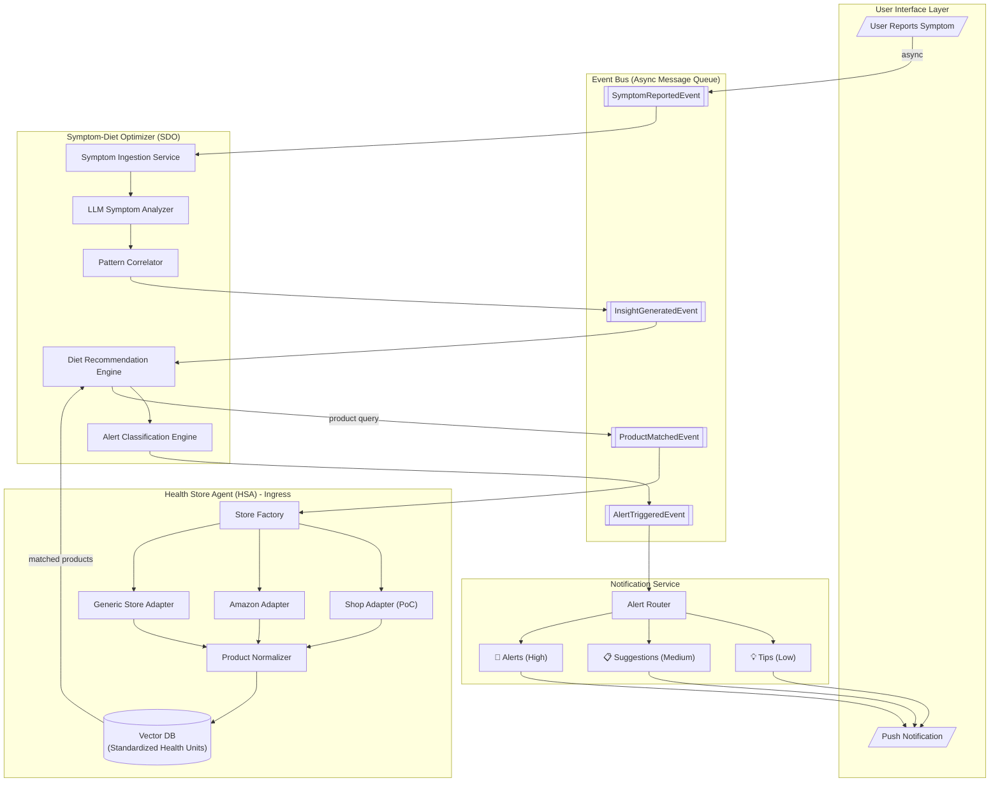
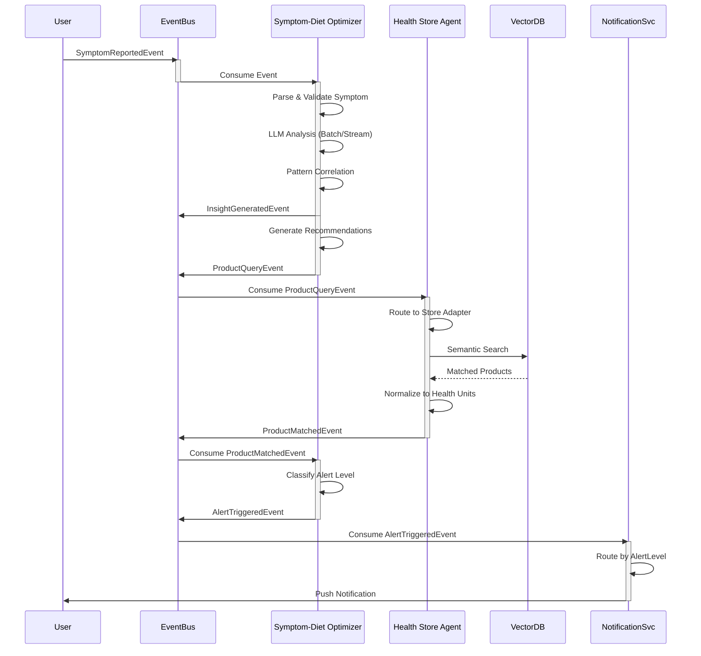
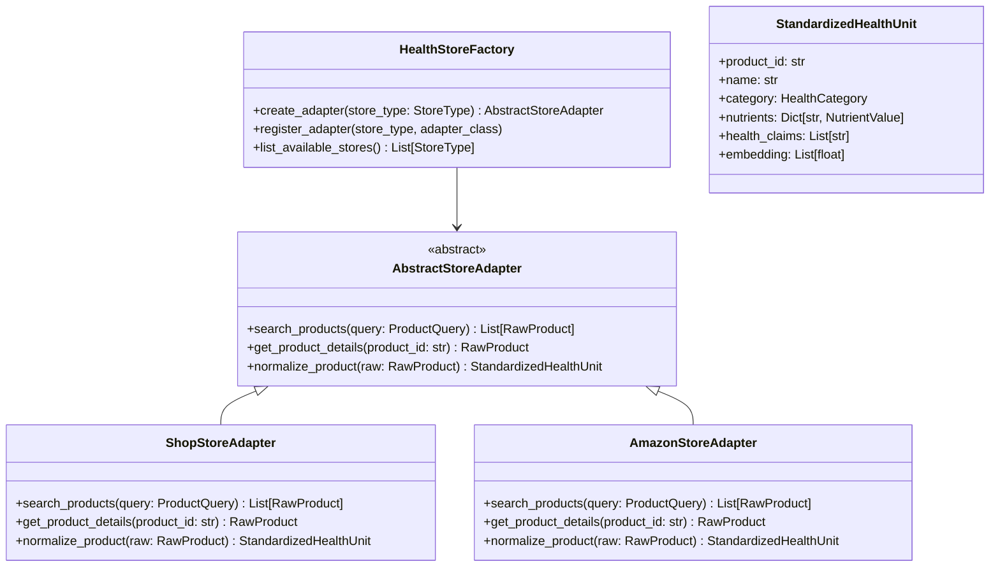
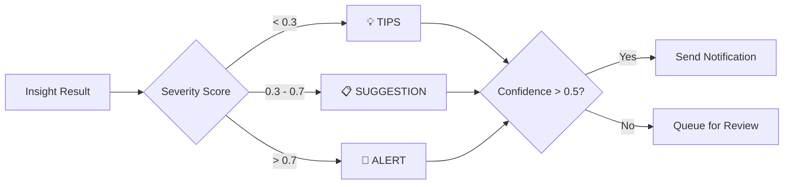

# Product Requirements Document: Syntropy Dieton Symptom-Diet Optimizer (SDO)

## Executive Summary

The **Syntropy Dieton Symptom-Diet Optimizer (SDO)** is an event-driven health insight system that processes asynchronously reported symptoms, generates real-time actionable insights, and delivers tiered notifications to users. The system integrates with health stores via a pluggable **Health Store Agent (HSA)** ingress layer, enabling seamless product recommendations from multiple vendors.

---

## System Architecture Overview



---

## Event-Driven Flow Diagram



---

## Component Specifications

### 1. Symptom-Diet Optimizer (SDO)

**Purpose**: Core engine that ingests symptoms, performs LLM-powered analysis, correlates patterns, and generates dietary recommendations with alert classifications.

**Capabilities**:
| Capability | Description |
|------------|-------------|
| `symptom_ingestion` | Async event consumer for user-reported symptoms |
| `llm_batch_analysis` | Batch processing of symptoms with streaming LLM |
| `pattern_correlation` | Historical pattern matching across user data |
| `deficiency_detection` | Identify nutritional deficiencies from symptoms |
| `recommendation_engine` | Generate personalized diet/supplement recommendations |
| `alert_classification` | Classify insights into TIPS/SUGGESTION/ALERT levels |

**Key Models**:
- `SymptomEvent` - Incoming symptom report
- `InsightResult` - Analyzed insight with confidence scores
- `DietRecommendation` - Actionable dietary suggestion
- `AlertNotification` - Tiered notification payload

### 2. Health Store Agent (HSA) - Ingress Layer

**Purpose**: Pluggable ingress abstraction that integrates any health/wellness store into the system, normalizing products into standardized health units for vector storage.

**Factory Pattern**:


### 3. Alert Classification System

**Alert Levels**:
| Level | Type | Trigger Condition | Action |
|-------|------|-------------------|--------|
| LOW | TIPS | General wellness insights | Passive notification |
| MEDIUM | SUGGESTION | Detected pattern requiring attention | Active notification with recommendations |
| HIGH | ALERT | Critical health indicator detected | Immediate notification with urgent action |

**Classification Logic**:


---

## Data Models

### Core Events

```python
class SymptomReportedEvent:
    event_id: UUID
    user_id: str
    timestamp: datetime
    symptoms: List[SymptomInput]
    context: Optional[Dict[str, Any]]

class InsightGeneratedEvent:
    event_id: UUID
    source_event_id: UUID
    user_id: str
    insights: List[HealthInsight]
    deficiencies: List[NutritionalDeficiency]
    confidence: float

class AlertTriggeredEvent:
    event_id: UUID
    user_id: str
    alert_level: AlertLevel  # TIPS | SUGGESTION | ALERT
    title: str
    message: str
    recommendations: List[Recommendation]
    products: Optional[List[StandardizedHealthUnit]]
```

### Standardized Health Unit (Vector Storage)

```python
class StandardizedHealthUnit:
    id: str
    source_store: StoreType
    source_product_id: str
    name: str
    description: str
    category: HealthCategory
    subcategory: Optional[str]

    # Nutritional data (normalized)
    nutrients: Dict[str, NutrientValue]
    serving_size: ServingSize

    # Health metadata
    health_claims: List[str]
    allergens: List[str]
    dietary_tags: List[DietaryTag]  # vegan, gluten-free, etc.

    # Vector embedding for semantic search
    embedding: List[float]

    # Pricing/availability
    price: Optional[MoneyAmount]
    availability: AvailabilityStatus
    affiliate_link: Optional[str]
```

---

## Technical Requirements

### Event Processing
- **Message Queue**: Redis Streams or RabbitMQ for event bus
- **Event Schema**: JSON with Pydantic validation
- **Processing Mode**: Async consumers with batch windowing
- **Retry Policy**: Exponential backoff with dead-letter queue

### LLM Integration
- **Primary Provider**: OpenRouter (DeepSeek)
- **Fallback**: OpenAI GPT-4
- **Processing**: Streaming for real-time, batch for historical analysis
- **Caching**: Redis cache for repeated queries

### Vector Database
- **Engine**: Milvus or pgvector
- **Embedding Model**: OpenAI text-embedding-3-small
- **Index Type**: IVF_FLAT for product search
- **Dimensions**: 1536 (OpenAI embeddings)

### Database Schema
- Leverage existing models from `apps/Syntropy-Journals/app/models/syntropy/`
- Extend with new SDO-specific models in `diet/models/`

---

## Implementation Phases

### Phase 1: Core SDO Refactor
- [ ] Merge MPA → SDO architecture
- [ ] Implement event-driven symptom ingestion
- [ ] Create SDO engine with LLM batch/stream processing

### Phase 2: Health Store Agent (HSA)
- [ ] Create AbstractStoreAdapter interface
- [ ] Implement HealthStoreFactory
- [ ] Build ShopStoreAdapter (PoC)
- [ ] Product normalization to StandardizedHealthUnit

### Phase 3: Alert & Notification System
- [ ] Alert classification engine
- [ ] Notification routing (TIPS/SUGGESTION/ALERT)
- [ ] User preference management

### Phase 4: Integration & Testing
- [ ] End-to-end event flow tests
- [ ] LLM batch stream processing tests
- [ ] Data fetch and change capture tests

---

## Success Metrics

| Metric | Target |
|--------|--------|
| Symptom-to-Insight Latency | < 5 seconds |
| Alert Accuracy | > 85% precision |
| Product Match Relevance | > 80% user acceptance |
| System Uptime | 99.9% |

---

## Appendix: Directory Structure

```
diet-insight-engine/
├── diet/
│   ├── models/
│   │   ├── __init__.py
│   │   ├── shared.py
│   │   ├── events.py              # Event schemas
│   │   ├── alerts.py              # Alert/notification models
│   │   └── health_units.py        # StandardizedHealthUnit
│   ├── sdo/                       # Symptom-Diet Optimizer
│   │   ├── __init__.py
│   │   ├── engine.py              # Core SDO engine
│   │   ├── analyzer.py            # LLM symptom analyzer
│   │   ├── correlator.py          # Pattern correlation
│   │   ├── recommender.py         # Diet recommendations
│   │   └── alert_classifier.py    # Alert level classification
│   ├── health_store_agent/        # HSA Ingress
│   │   ├── __init__.py
│   │   ├── factory.py             # HealthStoreFactory
│   │   ├── base_adapter.py        # AbstractStoreAdapter
│   │   ├── normalizer.py          # Product normalizer
│   │   └── adapters/
│   │       ├── __init__.py
│   │       ├── shop_adapter.py    # Shop PoC
│   │       └── amazon_adapter.py  # Amazon integration
│   ├── events/                    # Event bus
│   │   ├── __init__.py
│   │   ├── bus.py                 # Event bus implementation
│   │   ├── consumers.py           # Event consumers
│   │   └── producers.py           # Event producers
│   └── notifications/             # Notification service
│       ├── __init__.py
│       ├── router.py              # Alert routing
│       └── handlers.py            # Notification handlers
└── tests/
    ├── test_sdo_engine.py
    ├── test_health_store_agent.py
    ├── test_events.py
    └── test_notifications.py
```
